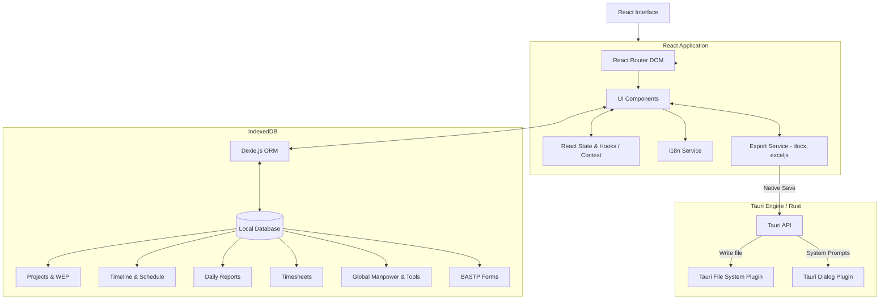

# System Architecture Diagram

```mermaid
graph TD
    %% User Tier
    UI[React Interface]
    
    %% Presentation Tier (Vite / React Context)
    subgraph Frontend [React Application]
        Router[React Router DOM]
        State[React State & Hooks / Context]
        Components[UI Components]
        i18n[i18n Service]
        ExportService[Export Service - docx, exceljs]
    end
    
    %% API & Processing Tier (Tauri Integration)
    subgraph DesktopEngine [Tauri Engine / Rust]
        TauriAPI[Tauri API]
        FSService[Tauri File System Plugin]
        DialogService[Tauri Dialog Plugin]
    end
    
    %% Data Tier
    subgraph LocalStorage [IndexedDB]
        Dexie[Dexie.js ORM]
        DB[(Local Database)]
        
        %% Entities
        DB --> WEP[Projects & WEP]
        DB --> Timeline[Timeline & Schedule]
        DB --> DailyReports[Daily Reports]
        DB --> Timesheet[Timesheets]
        DB --> Resources[Global Manpower & Tools]
        DB --> BASTP[BASTP Forms]
    end

    %% Connections
    UI --> Frontend
    Frontend --> Router
    Router --> Components
    Components <--> State
    Components --> i18n
    Components <--> ExportService
    Components <--> Dexie
    Dexie <--> DB
    
    %% Desktop Integration
    ExportService -- Native Save --> TauriAPI
    TauriAPI -- Write file --> FSService
    TauriAPI -- System Prompts --> DialogService
```
